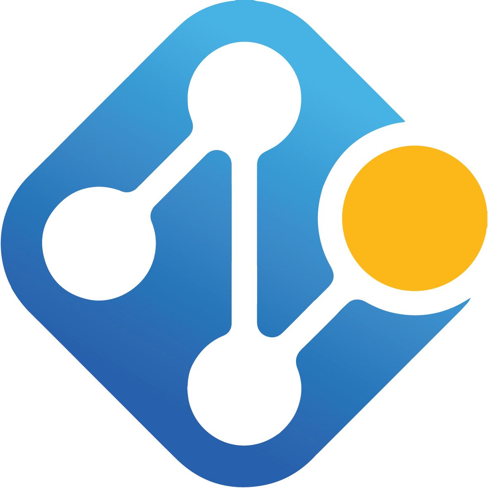

Nodedge
=======
A Python3 graphic environment for next-generation engineering.

<a href="www.nodedge.io">Nodedge.io</a>

# What is Nodedge?

Nodedge is the first free and open-source graphical editor for engineering applications.
It provides you with a powerful graphical environment for physical modelling, real-time simulation and testing, data plotting and analysis, and code generation. 
Within Nodedge, you can sketch your program by simply drag-and-dropping graphic blocks.
Nodedge is written in Python and its code is freely accessible on Github.

 

 

<h3>Physical simulation</h3>
Within Nodedge simulation app, you can simulate physical models, chemical processes, robotic systems, and many others.

<h3>Data plotting and analysis</h3>
Within Nodedge plotting app, you can easily import data from the simulation app or a file, plot them and analyze them.

<h3>Code generation</h3>
Within Nodedge code generation app, you can graphically design the software for supported target hardware, and flash it to your platform.

# Getting started

For getting started [download](https://github.com/nodedge/nodedge/releases/download/v0.3.0/NodedgeSetup.exe) our software or clone our repository from [Github](https://github.com/nodedge/nodedge).

# How to install from source

`pip install nodedge`

# Roadmap

Currently, Nodedge provides a graphical scripting environment with real-time evaluation.
However, Nodedge is undergoing a major development phase.
We are working hard to provide you with unique features:
* a versatile and customizable **plotting environment** for the analysis of time series;
* support of the most common data file format;
* a **simulation environment** for the simulation of physical models, chemical processes, robotic systems, and many others;
* support for robotics-specific features, such as **embedded code generation** for common hardware platform, real-time data acquisition and inspection.

