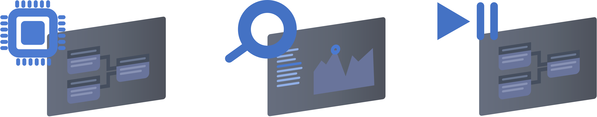

# What is Nodedge?

Nodedge is a powerful graphical-programming environment designed by engineers for engineers. It lets you design multi-domain simulations by drag-and-dropping built-in graphic blocks.

Nodedge is open-source, and it is written in Python, today's number one scripting language. It provides you with a Python command line, the possibility to customize your block, and generate Python code from your diagrams. Nodedge graphical interface is based on PySide6 to access to the complete Qt framework for next-generation user experience.

Nodedge is multi-purpose. 
Currently, Nodedge provides a graphical scripting environment with real-time evaluation.
Our short-term goal is to provide support for **system design**, **simulation**, and **data plotting and analysis**. 
Our mid-term goal is to add support for robotics-specific features, such as **embedded code generation** for common hardware platform, real-time data acquisition and inspection.

 

# Getting started

For getting started [download](https://github.com/nodedge/nodedge/releases/download/v0.2.3/NodedgeSetup.exe) our software or clone our repository from [Github](https://github.com/nodedge/nodedge).

# Roadmap

Nodedge is undergoing a major development phase. 
We are working hard to provide you with unique features:
* a versatile and customizable plotting environment for the analysis of time series;
* support of the most common data file format;
* a simulation environment for the simulation of physical models, chemical processes, robotic systems, and many others.
