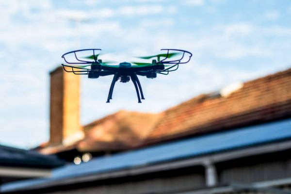

# What is Nodedge?

Nodedge is the first free and open-source graphical editor for engineering applications. It provides a comprehensive 
and intuitive environment for a variety of applications. With Nodedge, you can:
* design and **simulate dynamical systems** such as robotic, physical, and chemical systems
* **generate Python code** from your diagram-like models with a simple click
* interactively plot and edit the data generated by your simulation
* **plot and analyze log files** with common extensions like csv, mf4, mat, and others.

The user interface is designed for simplicity, allowing you to **sketch your program in a diagram-like flow** 
by drag-and-dropping graphic blocks. A set of built-in block libraries implements common functionalities like scalar and matrix operations, 
integration, differentiation, and many others. You can also implement your own custom blocks, reuse and 
share them with the community. 

Nodedge is **written in Python**, the number one programming language in the world for the number of users, and its code is fully 
transparent and **freely available on GitHub** for community collaboration and contributions. This ensures that Nodedge is 
constantly evolving and improving based on the latest needs of its users.

 

 

## Physical simulation

The Nodedge simulation app allows you to simulate various types of systems and processes. 
These simulations can suit a variety of purposes, such as testing and analyzing the behavior of a physical model, 
predicting the outcomes of a chemical reaction, or studying the movements and actions of a robotic system.
To learn more about it, check out the [examples](resources.md#quick-start-examples) provided.

## Data plotting and analysis

Nodedge provides you with an interactive plotting app, Dats. Within Dats, you can easily import the data generated by 
your simulation, plot, edit, and export it.
You can create new variables, also called signals, by modifying the existing ones, filtering, and combining them.
To learn more about it, check out the [examples](resources.md#quick-start-examples) provided.

## Code generation

Nodedge supports the generation of standalone Python scripts from any graphical model.
In the near future, Nodedge has the goal to support code generation for various microcontroller targets. 
This means that users will be able to create their models graphically and then use Nodedge to convert those models into 
code that can be understood by off-the-shelf microcontrollers and uploaded to the hardware. 

# Industries

  

    
    Robotics
  

  

    
    Automotive
  

  

    
    UAVs
  

  

    
    Energy & electrification
  

  

    
    Aerospace
  

  

    
    Pharmaceutical
  

