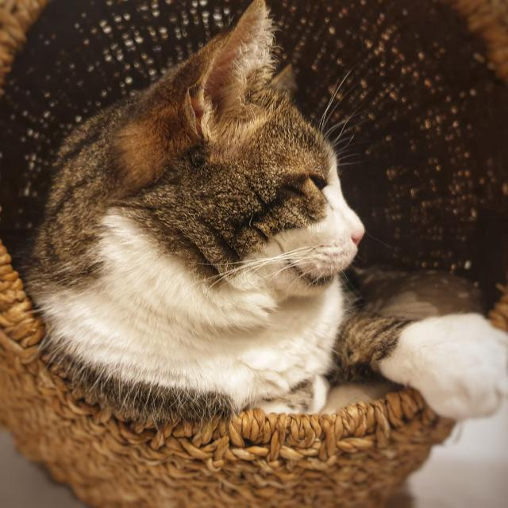

# Our mission
Nodedge's mission is to redefine the standards of scientific scripting and model-based design.
Nodedge is the first **free and open-source** graphic environment for scientists and engineers.
It is based on the **latest-generation technology** for a user experience that has never been so enjoyable.

# Our vision
Why should scientific knowledge be only for a few? By making Nodedge open source and free, we intend to
**democratize knowledge**, **incentivize collaboration**, and give everyone the tool they deserve to create the
**innovations of tomorrow**.

# Meet our team

 <b>Enrica Soria</b>   
Developer and operations

 <b>Anthony De Bortoli</b>   
Main developer

  
 <b>Pongy</b>   
Our mascotte

# Our contacts

**Address**: Lausanne (1005), Switzerland 
**Email**: [admin@nodedge.io](mailto:admin@nodedge.io) 
**Telephone**: (+41) 076 448 14 24
