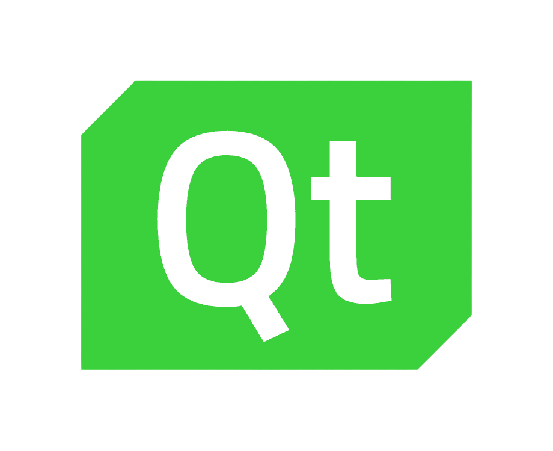
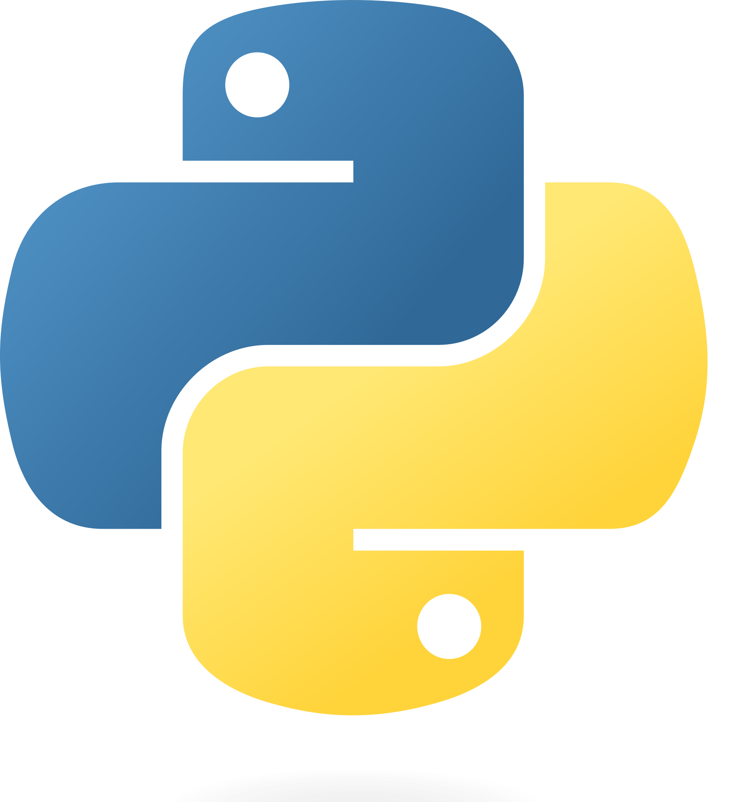

## Graphical programming

Instead of writing complex lines of text code, you can focus on the logical flow 
and create your program by simply combining built-in blocks, the *nodes* in a 
diagram-like structure with *edges*.
Nodes allow you to perform mathematical operations, simulate plants, process signals,
design and reuse patterns, and perform many others. They can be easily dragged and dropped
from the node list, and configured to your needs. You can also create your own custom nodes
and share them with other users.

## Source code access

Nodedge is the first scientific editor with source code access. 
Its code is freely accessible and auditable on Github.
This allows the community to contribute, engage, audit, report and fix issues.

  

## New generation interface

Nodedge graphics is based on Qt, the industry-leading framework for interfaces that users love.
Compare the other graphic programming solutions, Nodedge has improved ergonomy and more intuitive user interaction.

  

## Python-based software

Nodedge is written in Python3, the most popular scripting language.
The graphical scripting functionality also provides Python3 code generation from the graphic blocks in the scene.
Moreover, the custom block allows you to code your own graphic block - with a custom functionality - in Python.

  

## Portability and collaboration

Nodedge is cross-platform. You can install it on Windows, MacOS, and Linux.
Nodedge project files are saved in a JSON format, which makes portability and versioning 
easy. For next-level collaboration experience, we aim at making simultaneous editing possible.
You and your colleagues will be able to access the same project, from anywhere, with no conflicts
or latencies.
    