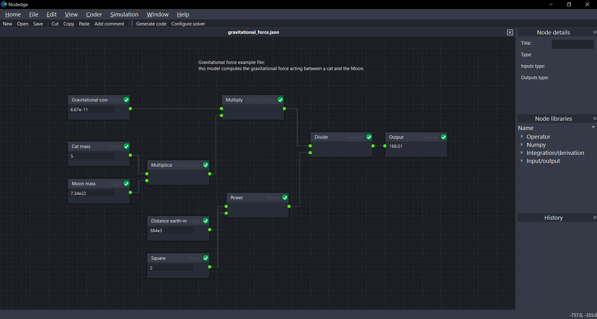
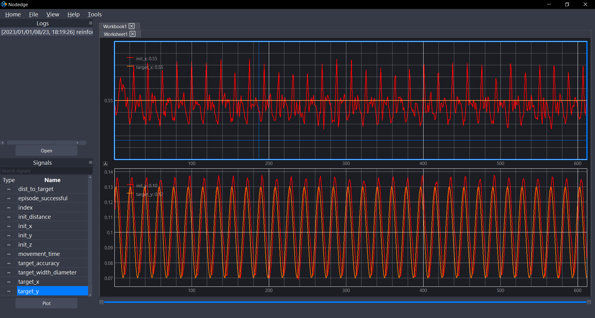

# Installation

You can install Nodedge in different ways.

**Download the installer**

* Windows: [download latest release](https://github.com/nodedge/nodedge/releases/download/v0.3/NodedgeSetup.exe)
* macOS: please bear with us, we are currently in the process of developing it!
* Linux: please bear with us, we are currently in the process of developing it!


**Install from pip**

Alternatively, you can install Nodedge form pip with:
```
pip install nodedge
```

**Clone from GitHub**

Alternatively, you can clone our project from [Github](https://github.com/nodedge/nodedge) and install the requirements with:
```
git clone https://github.com/nodedge/nodedge nodedge
cd nodedge
pip install -r .\requirements\freeze\requirements_dev.txt
```

# Quick start examples

The list of examples is constantly expanding. You can find an up-to-date list in the [*examples* folder](https://github.com/nodedge/nodedge/tree/main/examples) 
on GitHub.
The examples provided below will allow you to get started with Nodedge.

## Create a model in Nodedge

In this example, we demonstrate how to create a model in Nodedge to calculate the gravitational force between two objects:
1. In Nodedge, create a new file by clicking on `File` > `New`
2. Add input nodes to your model to represent the constant variables of the gravitational force. 
From the *Node libraries* widget on the right, drag-and-drop `Input` nodes to the scene and insert the constant values in their labels
3. Rename the input nodes by editing their title in the *Node details* widget on the right
4. From the `Operator` library, drag-and-drop `Multiplication`, `Division`, and `Power` nodes to the scene and connect them to the input nodes
5. Connect an output node to display the result of the computation.

Congratulations! You have just created your first Nodedge model!
If you want to compute the gravitational force for different objects, simply edit the mass values in the input nodes.
Nodedge will instantly re-evaluate the model and display the updated result.

<br>
 
<center></center>

## Open a dataset in Dats

In this example, we show you how to import a dataset into Dats, plot the signals contained within it, and add new ones:
1. Open Dats by clicking on its icon in the home page
2. Click on `File` > `Open` then navigate to the example file `examples/csv_analyzer/reinforcement_learning_data.csv`
3. Click on `Open`
4. From the *Signals* widget on the left, select `init_x` and `target_x` by clicking on their labels
5. Plot the curves by: 
   * clicking on the `Plot` button, or
   * drag-and-dropping the signals to the worksheet
6. Right-click on the worksheet window, then click on `Add subplot`
7. Plot the `init_y` and `target_y` signals as done at step 5
8. To save the current Dats configuration, click on `File` > `Save configuration`, then navigate to the folder where you want to save the configuration file
and enter a file name like `csv_analyzer_config.json`. Click on `Save`

Congratulations! You have successfully analyzed your first dataset in Dats!

<br>

<center></center>


# Contributing

You can contribute to Nodedge in several ways: 
* [Donate]() to let us cover basic expenses (e.g. domain name, tooling, etc.), as well as the creation of free and open-source Nodedge features
* [Submit your feedback](mailto:admin@nodedge.io). Share your goals and tell us how Nodedge can help
* [Share example files](mailto:admin@nodedge.io)
* Report bugs on [Nodedge issue tracker](https://github.com/nodedge/nodedge/issues)
* Fix bugs and write documentation. To start contributing to Nodedge, you can check out the [guidelines for contributors](https://github.com/nodedge/nodedge/wiki)

For developing Nodedge, we recommend using PyCharm IDE. 
You can find helpful information on how to install and set it up on [Nodedge Wiki](https://github.com/nodedge/nodedge/wiki/Pycharm-setup) and [PyCharm website](https://www.jetbrains.com/pycharm/).
