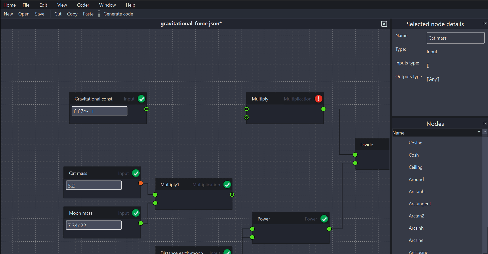
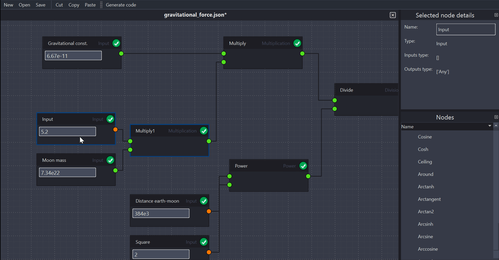

# Documentation

Nodedge’s user manual is available online and is automatically updated every time the API is updated.

* [Nodedge user manual](https://nodedge.readthedocs.io/en/latest/)
* [Github wiki](https://github.com/nodedge/nodedge/wiki)

# Examples

The list of examples is growing day by day.
Find some [here](https://github.com/nodedge/nodedge/tree/master/examples).

# Tutorials

Here we offer a collection of free tutorials to get started with Nodedge and to explore the more advanced Nodedge features.
This library is greatly under construction, we would appreciate your help in improving it!

> Add a node

 

> Add an edge

> Rename a node

  

> Navigate the scene

