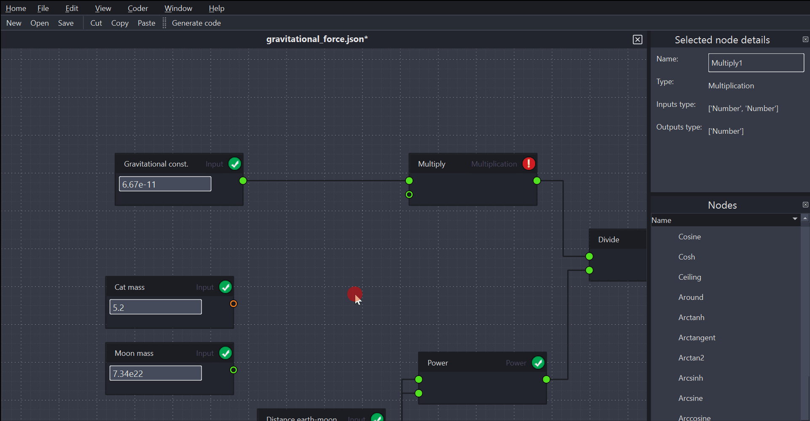
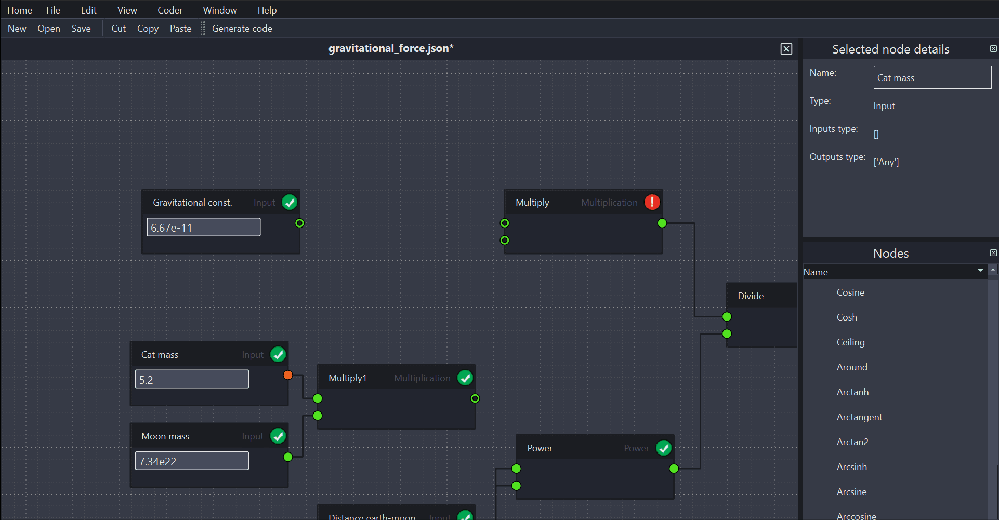

# Nodedge tutorials

In the following tutorials, we describe how to perform basic Nodedge actions step-by-step.
Please be aware that Nodedge is still under active development, so this list may not be comprehensive or up-to-date. 
We welcome your feedback and contributions to improve it.

## Create a new model

> 1. Open Nodedge by clicking on its icon in the home page
> 2. Open a new file by:
>    * clicking on `File` > `New` in the Menu bar, or
>    * clicking on the `New` button in the Tool bar, or
>    * using `CTRL+N` shortcut
 
 

## Import a model

> 1. Open Nodedge by clicking on its icon in the home page
> 2. Open the existing file by:
>    * clicking on `File` > `Open` in the Menu bar, or
>    * clicking on the `Open` button in the Tool bar, or
>    * using `CTRL+O` shortcut
> 3. In the file dialog, select the file to open
 

## Save a model

> * Click on `File` > `Save` in the Menu bar, or
> * Click on the `Save` button in the Tool bar, or
> * Use `CTRL+S` shortcut
 

## Add a node

> Nodes are arranged by category in the node libraries. 
> 1. Select the appropriate library by clicking on it in the *Node libraries* widget to the right of the scene
> 2. Find the required node
> 3. Drag-and-drop it to the scene
>
> Alternatively:
> 1. Right-click on the scene
> 2. Place your cursor on the appropriate library 
> 3. Click on the required node
>
> If needed, edit the node configuration (e.g., change title, value, etc.) and connect it to your model.

 

## Rename a node

> 1. Click on the node
> 2. Edit the title in the *Node details* widget on the right.
> 3. Click on `Enter` key. The node will show the new title

  

## Add an edge

> 1. Click on the output socket of a node
> 2. Then, click on the input socket of another node
>
> The two nodes will be connected by a graphic edge and their respective sockets will change style to let you know that they
> are now taken. There can be a single edge connected to one input socket. When trying to connect a second edge to the 
> an input socket which is already taken, the latter will connect to the new edge and automatically disconnect from the 
> previous one.

## Add a comment

> 1. Click on `Add comment` in the Tool bar. A comment will appear in your scene with some dummy text
> 2. Click on the comment and edit the text
> 3. Click outside the text to validate your comment

## Navigate the scene

> To navigate the scene, you can use the arrows keys.

## Select multiple objects

> To select multiple objects (nodes and edges) in the scene, click on the scene and drag the cursor.
> All the objects within your selection will be selected.

## Copy, paste, and cut

> 1. Select the objects in the scene that you want to modify
> 2. Then:
>    * click on the `Copy`, `Paste`, or `Cut` button in the Tool bar, or
>    * use the `CTRL+C`, `CTRL+V`, or `CTRL+X` shortcuts

## Fit model to view

> To fit the current model to the view:
> * Click on the `Spacebar` key, or
> * Click on `View` > `Fit to view` in the Menu bar

## Generate script from model

> To generate a Python script from the open model:
> 1. Start the code generation by:
>    * clicking on `Coder` > `Generate code` in the Menu bar, or
>    * clicking on the `Generate code` button in the Tool bar
> 2. Select the folder where to save the script and type the name of the file to be saved
> 3. Click on the `Save` button

# Dats tutorials

## Open a dataset

> Dats can handle a variety of dataset extensions: csv, txt, json, and tdms. We are planning to add support for hdf and rosbag, too.
> To open a dataset in Dats:
> 1. Open Dats by clicking on its icon in the home page
> 2. Open a file by:
>    * clicking on `File` > `Open` in the Menu bar, or
>    * using `CTRL+O` shortcut
> 3. In the file dialog, select the file to open
> 
> The log will appear in the *Logs* widget on the left side of the page. The signals contained in the log will be listed in the
> *Signals* widget.

## Plot a signal

> 1. In the *Signals* widget, select the name of the signal you want to plot
> 2. To plot it:
>    * drag and drop the signal in the subplot area, or
>    * click on the `Plot` button at the bottom of the *Signals* widget
>
> You can also select and plot multiple signals at once. To do so, hold down the `CTRL` or `SHIFT` key to perform the 
> multiple section.

## Create a subplot

> A subplot is a graphical area where one or more curves can be plotted. It contains two distinct axes, the x-axis and y-axis, 
> which are shared by all the curves within the subplot.
> 
> * Right-click on the worksheet area, then click on `Add subplot`

## Create a worksheet

> A worksheet is a window that contains one or multiple subplots where you can plot signals. 
> To create a worksheet: 
> 
> * Click on `File` > `Create worksheet` in the Menu bar, or
> * Use `CTRL+SHIFT+N` shortcut

## Create a workbook

> A workbook is a collection of worksheets. Workbooks can be useful for organizing data plots into different 
> categories. You can create multiple workbooks as needed to effectively manage your plots.
> To create a workbook:
> 
> * Click on `File` > `Create workbook` in the Menu bar, or
> * Use `CTRL+SHIFT+N` shortcut

## Save Dats configuration

> Data can store the configuration of a work session, including workbooks, worksheets, and subplots layout, as well as 
> the formulas of any signals created. 
> This function is useful for freezing the current work session and allowing you to return to it at a later time. 
> It is also helpful for regularly working with logs that contain the same signals.
>
> 1. Click on `File` > `Save configuration` in the Menu bar
> 2. Select the folder where to save the configuration file and edit the file name
> 3. Click on `Save`. A JSON file will be saved in the selected folder

## Restore Dats configuration

> 1. Click on `File` > `Restore configuration` in the Menu bar
> 2. In the file selection window that opens, navigate to the file that you want to restore
> 3. Click on `Open`.

## Fit content to view

> This functionality allows you to fit all plotted curves into the view. To do so:
> 
> * Click on `View` > `Fit to view`, or
> * Press the `Spacebar` key
 
## Create new signal

> In Dats, signals may be native or derived from a user-provided formula. Native signals are those imported from a dataset and 
> they are denoted with a tilde (`~`) in the *Signals* widget, while signals derived from a formula are indicated with the letter `f`.
> 
> 1. Click on `Tools` > `Create signal` in the Menu bar
> 2. In the signal editor window that opens, edit the name and formula of the signal to be created. If the formula includes  
> existing signals, you can either manually type their name or double-click on them from the signal list on the left 
> to paste their name
> 3. Validate your formula by clicking on `Ok`

## Edit curve color

> 1. Right-click on the curve
> 2. Select the `Customize curve` action
> 3. In the color window, you can select a color from the palette or specify the hex value
> 4. Once you are done, click on `Ok`

## Delete a curve

> To delete a curve from a subplot:
> 1. Click on the curve to be deleted
> 2. Delete it by:
>    * clicking on `Tools` > `Delete curve`, or
>    * pressing the `Del` key
